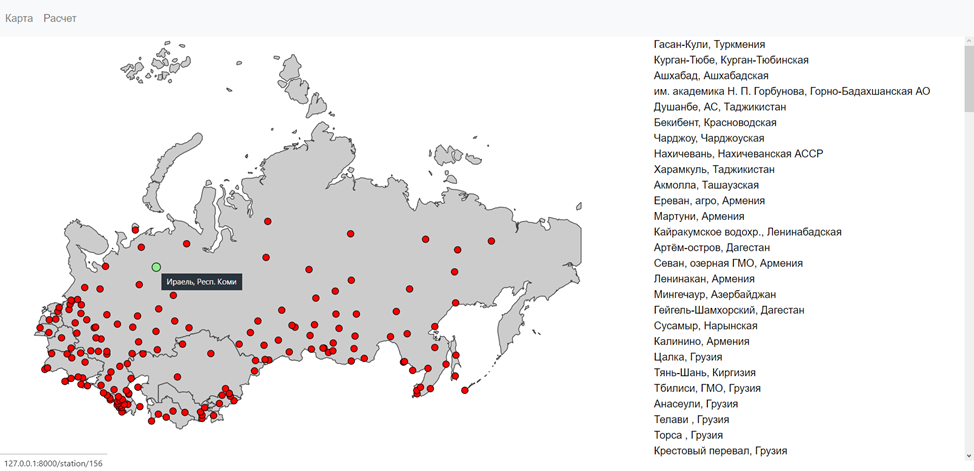
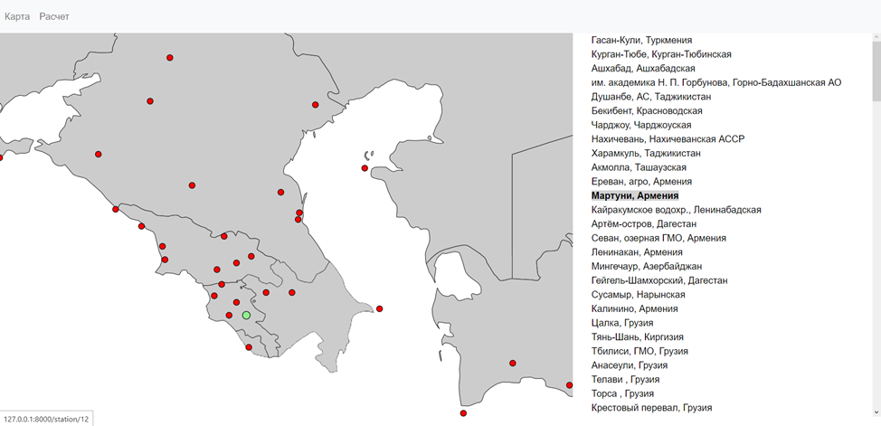
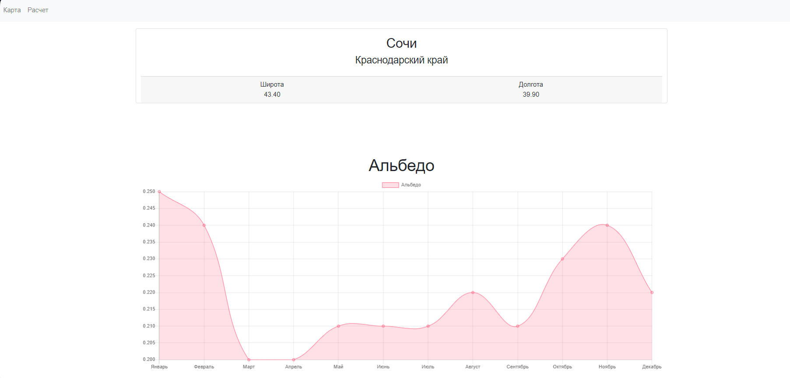
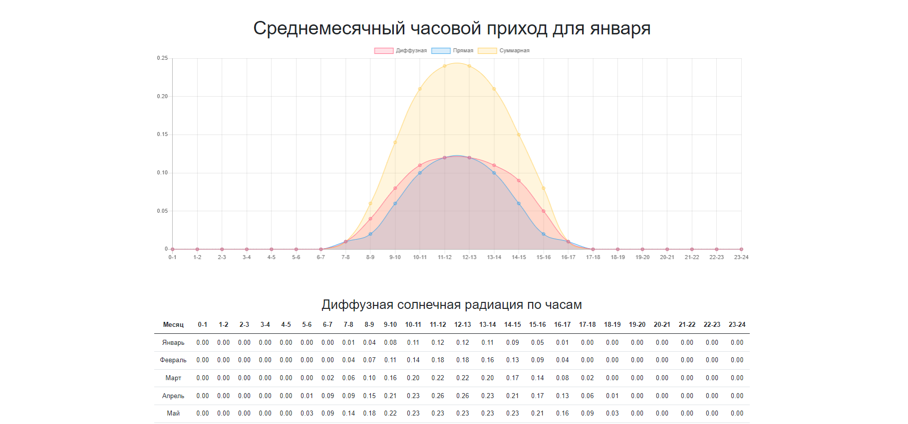
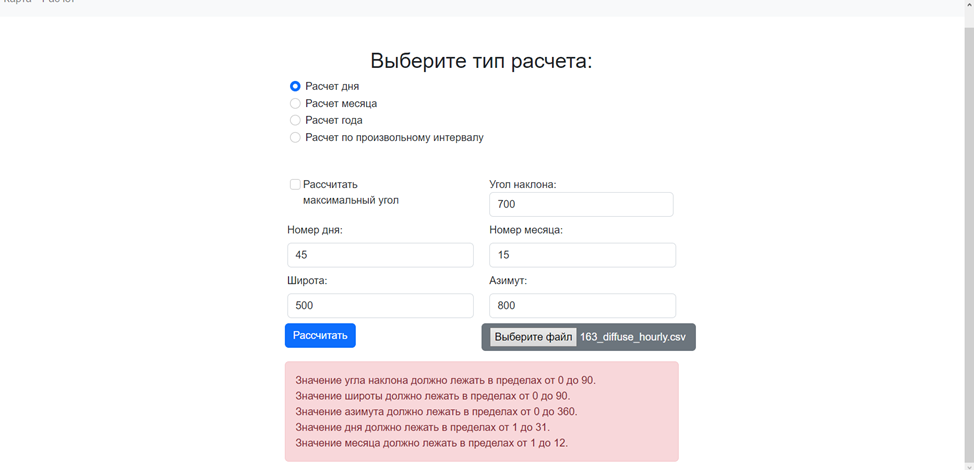

**Исполнитель:** Замалютдинов Руслан Айдарович              
**Telegram:** @abc4321abc   

**Дипломная работа по теме "Разработка WEB-приложения для расчета прихода инсоляции на наклонную плоскость"**

## Оглавление
**[ЧАСТЬ 1: Описание](#part1)**    
**[ЧАСТЬ 2: Клиентское приложение](#part2)**      
&emsp;**[2.1 Главная страница](#part2.1)**    
&emsp;**[2.2 Страница с информацией о станции](#part2.2)**    
&emsp;**[2.3 Страница расчетов инсоляции](#part2.3)**     
**[ЧАСТЬ 3: API](#part3)**    
&emsp;**[3.1 API Инсоляция для горизонтальной плоскости](#part3.1)**    
&emsp;&emsp;**[3.1.1 Получить станцию по id](#part3.1.1)**    
&emsp;&emsp;**[3.1.2 Получение информации по всем станциям](#part3.1.2)**     
&emsp;&emsp;**[3.1.3 Получение альбедо по идентификатору станции](#part3.1.3)**     
&emsp;&emsp;**[3.1.4 Получение среднедневной солнечной радиации](#part3.1.4)**     
&emsp;&emsp;**[3.1.5 Получение среднемесячной солнечной радиации](#part3.1.5)**     
&emsp;&emsp;**[3.1.6 Получение среднечасовой солнечной радиации](#part3.1.6)**     
&emsp;**[3.2 API Инсоляция для наклонной плоскости](#part3.2)**  
&emsp;&emsp;**[3.2.1 Расчет по дням](#part3.2.1)**    
&emsp;&emsp;**[3.2.2 Расчет по месяцам](#part3.2.2)**     
&emsp;&emsp;**[3.2.3 Расчет по годам](#part3.2.3)**     
&emsp;&emsp;**[3.2.4 Расчет по произвольному периоду](#part3.2.4)**   

****
## <a name="part1">ЧАСТЬ 1: Описание</a>
Приложение предоставляет следующий функционал:

1. **Интерактивная карта**: 
   - Отображение станций, расположенных в странах бывшего СССР.
   - Наведение на станцию на карте показывает краткую информацию о ней.
   - Нажатие на станцию перенаправляет на страницу с подробной информацией.
   - Подсветка соответствующей точки на карте при наведении на элемент списка.
   - Масштабирование карты

2. **Страница с подробной информацией о станции**:
   - Отображение данных о координатах станции.
   - Информация о альбедо, диффузных, прямых и суммарных месячных суммах солнечной радиации.
   - Среднемесячный часовой приход для января и июня.
   - Представление данных в графическом и табличном форматах.
   - Возможность скачать данные в формате CSV.

3. **Расчет инсоляции на наклонную плоскость**:
   - Расчет инсоляции за день, месяц, год или произвольный период.
   - Детальный расчет месяца по каждому часу или дню.
   - Детальный расчет года по каждому часу, дню или месяцу года.
   - Расчет угла наклона солнечной панели для максимального прихода инсоляции.

Это приложение предоставляет пользователям удобный доступ к данным о солнечной радиации и позволяет им производить расчеты, необходимые для оптимального использования солнечной энергии, а также исследований в области солнечной энергетики.

****
## <a name="part2">ЧАСТЬ 2: Клиентское приложение</a>

## <a name="part2.1"></a>**2.1 Главная страница**
На рисунках ниже представлена главная страница сайта и способ навигации на ней:




## <a name="part2.2"></a>**2.2 Страница с информацией о станции**





## <a name="part2.3"></a>**2.3 Страница расчетов инсоляции**



****
## <a name="part3">ЧАСТЬ 3: API</a>

## <a name="part3.1"></a>**3.1 API Инсоляция для горизонтальной плоскости**   

## <a name="part3.1.1"></a>**3.1.1 Получить станцию по id**

**URL:**

&emsp; `/api/v1/station/<stationId:int>`

**METHOD:** GET

**Response Body:**

```json5
[
    {
        "id": 5,
        "station_name": "Душанбе, АС",
        "region": "Таджикистан",
        "latitude": "38.50",
        "longitude": "68.80"
    }
]
```
**Статус-коды:**

&emsp;`200` – успешно создано,  
&emsp;`400` – ошибка входных данных,    
&emsp;`500` – сервер не доступен(ошибка железа),  
&emsp;`503` – сервер не доступен (ошибка сервиса).

### <a name="part3.1.2"></a>**3.1.2 Получение информации по всем станциям**

**METHOD:** GET

**URL:**

&emsp; `/api/v1/station`

**Response Body:**

```json5
[
    {
        "id": 1,
        "station_name": "Гасан-Кули",
        "region": "Туркмения",
        "latitude": "37.10",
        "longitude": "54.00"
    },
    // Дополнительные записи о станциях
]
```

**Статус-коды:**

&emsp;`200` – успешно создано,  
&emsp;`400` – ошибка входных данных,   
&emsp;`500` – сервер не доступен(ошибка железа),  
&emsp;`503` – сервер не доступен (ошибка сервиса).

### <a name="part3.1.3"></a>**3.1.3 Получение альбедо по идентификатору станции**

**METHOD:** GET

**URL:**

&emsp; `/api/v1/stations/<stationId:int>/albedo`

**Response Body:**

```json5
[
    {
        "station_id_id": 5,
        "month_1": "0.38",
        "month_2": "0.31",
        "month_3": "0.21",
        "month_4": "0.21",
        "month_5": "0.21",
        "month_6": "0.21",
        "month_7": "0.22",
        "month_8": "0.23",
        "month_9": "0.24",
        "month_10": "0.23",
        "month_11": "0.25",
        "month_12": "0.27"
    }
]
```

**Статус-коды:**

&emsp;`200` – успешно создано,  
&emsp;`400` – ошибка входных данных,    
&emsp;`500` – сервер не доступен(ошибка железа),  
&emsp;`503` – сервер не доступен (ошибка сервиса).

### <a name="part3.1.4"></a>**3.1.4 Получение среднедневной солнечной радиации**

**METHOD:** GET

**URL:**

Прямая среднедневная инсоляция:    
&emsp; `/api/v1/stations/{идентификатор станции}/direct-daily`

Диффузная среднедневная инсоляция:          
&emsp; `/api/v1/stations/{идентификатор станции}/diffuse-daily`

Суммарная среднедневная инсоляция:    
&emsp; `/api/v1/stations/{идентификатор станции}/total-daily`

**Response Body:**

```json5
[
    {
        "station_id_id": 5,
        "month_1": "0.89",
        "month_2": "1.26",
        "month_3": "1.80",
        "month_4": "2.60",
        "month_5": "4.03",
        "month_6": "5.21",
        "month_7": "5.22",
        "month_8": "4.67",
        "month_9": "3.84",
        "month_10": "2.36",
        "month_11": "1.41",
        "month_12": "0.78"
    }
]
```

**Статус-коды:**

&emsp;`200` – успешно создано,  
&emsp;`400` – ошибка входных данных,    
&emsp;`500` – сервер не доступен(ошибка железа),  
&emsp;`503` – сервер не доступен (ошибка сервиса).

### <a name="part3.1.5"></a>**3.1.5 Получение среднемесячной солнечной радиации**

**METHOD:** GET

**URL:**

Прямая среднемесячная инсоляция:    
&emsp; `/api/v1/stations/{идентификатор станции}/direct-monthly`

Диффузная среднемесячная инсоляция:          
&emsp; `/api/v1/stations/{идентификатор станции}/diffuse-monthly`

Суммарная среднемесячная инсоляция:    
&emsp; `/api/v1/stations/{идентификатор станции}/total-monthly`

**Response Body:**

```json5
[
    {
        "station_id_id": 5,
        "month_1": "34.01",
        "month_2": "39.90",
        "month_3": "55.28",
        "month_4": "67.25",
        "month_5": "69.41",
        "month_6": "70.92",
        "month_7": "71.73",
        "month_8": "66.91",
        "month_9": "55.83",
        "month_10": "43.31",
        "month_11": "31.17",
        "month_12": "30.48"
    }
]
```

**Статус-коды:**

&emsp;`200` – успешно создано,  
&emsp;`400` – ошибка входных данных,    
&emsp;`500` – сервер не доступен(ошибка железа),  
&emsp;`503` – сервер не доступен (ошибка сервиса).

### <a name="part3.1.6"></a>**3.1.6 Получение среднечасовой солнечной радиации**

**METHOD:** GET

**URL:**

Прямая среднечасовая инсоляция:    
&emsp; `/api/v1/stations/{идентификатор станции}/direct-hourly`

Диффузная среднечасовая инсоляция:          
&emsp; `/api/v1/stations/{идентификатор станции}/diffuse-hourly`

Суммарная среднечасовая инсоляция:    
&emsp; `/api/v1/stations/{идентификатор станции}/total-hourly`

**Response Body:**

```json5
[
    {
        "station_id_id": 97,
        "month_1": "0.00",
        "month_2": "0.00",
        "month_3": "0.00",
        "month_4": "0.00",
        "month_5": "0.00",
        "month_6": "0.00",
        "month_7": "0.00",
        "month_8": "0.00",
        "month_9": "0.00",
        "month_10": "0.00",
        "month_11": "0.00",
        "month_12": "0.00",
        "hour_num": 1
    }
]
```

**Статус-коды:**

&emsp;`200` – успешно создано,  
&emsp;`400` – ошибка входных данных,    
&emsp;`500` – сервер не доступен(ошибка железа),  
&emsp;`503` – сервер не доступен (ошибка сервиса).

### <a name="part3.1.6"></a>**3.1.6 Получение среднечасовой солнечной радиации в csv формате**

**METHOD:** GET

**URL:**

Прямая среднечасовая инсоляция:    
&emsp; `/api/v1/stations/{идентификатор станции}/direct-hourly/csv`

Диффузная среднечасовая инсоляция:          
&emsp; `/api/v1/stations/{идентификатор станции}/diffuse-hourly/csv`

Суммарная среднечасовая инсоляция:    
&emsp; `/api/v1/stations/{идентификатор станции}/total-hourly/csv`

**Response Body:**

```csv
hour_num,month_1,month_2,month_3,month_4,month_5,month_6,month_7,month_8,month_9,month_10,month_11,month_12
1,	0.00,	0.00,	0.00,	0.00,	0.00,	0.00,	0.00,	0.00,	0.00,	0.00,	0.00,	0.00,
2,	0.00,	0.00,	0.00,	0.00,	0.00,	0.00,	0.00,	0.00,	0.00,	0.00,	0.00,	0.00
3,	0.00,	0.00,	0.00,	0.00,	0.00,	0.00,	0.00,	0.00,	0.00,	0.00,	0.00,	0.00
4,	0.00,	0.00,	0.00,	0.00,	0.00,	0.00,	0.00,	0.00,	0.00,	0.00,	0.00,	0.00
5,	0.00,	0.00,	0.00,	0.00,	0.00,	0.00,	0.00,	0.00,	0.00,	0.00,	0.00,	0.00
6,	0.00,	0.00,	0.00,	0.01,	0.04,	0.05,	0.05,	0.02,	0.01,	0.00,	0.00,	0.00
7,	0.00,	0.00,	0.02,	0.06,	0.09,	0.09,	0.09,	0.07,	0.05,	0.01,	0.00,	0.00
8,	0.01,	0.02,	0.06,	0.12,	0.14,	0.14,	0.14,	0.12,	0.09,	0.06,	0.02,	0.01
9,	0.05,	0.08,	0.13,	0.17,	0.19,	0.18,	0.19,	0.17,	0.14,	0.11,	0.06,	0.05
10,	0.09,	0.13,	0.18,	0.20,	0.22,	0.20,	0.21,	0.19,	0.18,	0.14,	0.11,	0.08
11,	0.13,	0.17,	0.21,	0.22,	0.24,	0.21,	0.22,	0.21,	0.19,	0.17,	0.13,	0.12
12,	0.15,	0.19,	0.22,	0.25,	0.25,	0.22,	0.24,	0.21,	0.20,	0.17,	0.14,	0.13
13,	0.15,	0.19,	0.24,	0.25,	0.25,	0.21,	0.24,	0.21,	0.19,	0.17,	0.14,	0.13
14,	0.13,	0.18,	0.21,	0.22,	0.22,	0.21,	0.22,	0.20,	0.18,	0.15,	0.12,	0.11
15,	0.11,	0.14,	0.19,	0.20,	0.21,	0.20,	0.20,	0.19,	0.15,	0.13,	0.09,	0.08
16,	0.06,	0.11,	0.14,	0.17,	0.18,	0.17,	0.18,	0.15,	0.12,	0.08,	0.06,	0.05
17,	0.02,	0.05,	0.09,	0.11,	0.13,	0.13,	0.13,	0.12,	0.07,	0.05,	0.01,	0.01
18,	0.00,	0.01,	0.03,	0.06,	0.08,	0.09,	0.08,	0.07,	0.04,	0.01,	0.00,	0.00
19,	0.00,	0.00,	0.00,	0.01,	0.04,	0.05,	0.05,	0.02,	0.00,	0.00,	0.00,	0.00
20,	0.00,	0.00,	0.00,	0.00,	0.00,	0.01,	0.01,	0.00,	0.00,	0.00,	0.00,	0.00
21,	0.00,	0.00,	0.00,	0.00,	0.00,	0.00,	0.00,	0.00,	0.00,	0.00,	0.00,	0.00
22,	0.00,	0.00,	0.00,	0.00,	0.00,	0.00,	0.00,	0.00,	0.00,	0.00,	0.00,	0.00
23,	0.00,	0.00,	0.00,	0.00,	0.00,	0.00,	0.00,	0.00,	0.00,	0.00,	0.00,	0.00
24,	0.00,	0.00,	0.00,	0.00,	0.00,	0.00,	0.00,	0.00,	0.00,	0.00,	0.00,	0.00
```

**Статус-коды:**

&emsp;`200` – успешно создано,  
&emsp;`400` – ошибка входных данных,   
&emsp;`500` – сервер не доступен(ошибка железа),  
&emsp;`503` – сервер не доступен (ошибка сервиса).

## <a name="part3.2"></a>**3.2 API Инсоляция для наклонной плоскости**   

Структура CSV-файла, который нужно прикрепить для расчетов:

```csv
HOY,  DOY,  Month,   Day,  Hour, GHI,  DHI,  DirectHi,   Albedo
0,    1,    1,       1,    1,    1,    0.0,  0.0,        0
```

- HOY – час в году;
- DOY – день в году;
- Month – месяц;
- Day – день месяца;
- Hour – час дня;
- GHI – Глобальная горизонтальная радиация;
- DHI – Диффузионная горизонтальная радиация;
- DirectHI – Прямая горизонтальная радиация;
- Albedo – Альбедо (коэффициент диффузионного отражения).


### <a name="part3.2.1"></a>**3.2.1 Расчет по дням**

**METHOD:** POST

**URL:**

&emsp; `/api/v1/calc-by-day`

**Headers**

Content-type: multipart/form-data

**Form-data:**

| Ключ         | Тип значения        | Описание                                         |
|--------------|---------------------|--------------------------------------------------|
| file         | Text/csv            | Файл csv                                         |
| max-angle    | Строка (true/false) | true - будет считаться максимальный угол наклона |
| tilt-angle   | Число               | Угол наклона                                     |
| latitude     | Число               | Широта                                           |
| azimuth      | Число               | Азимут                                           |
| by-day-day   | Число               | Номер дня                                        |
| by-day-month | Число               | Номер месяца                                     |


**Response Body:**

&emsp; CSV-файл с результатами


**Статус-коды:**

&emsp;`200` – успешно создано,  
&emsp;`400` – ошибка входных данных,   
&emsp;`500` – сервер не доступен(ошибка железа),  
&emsp;`503` – сервер не доступен (ошибка сервиса).

### <a name="part3.2.2"></a>**3.2.2 Расчет по месяцам**

**METHOD:** POST

**URL:**

&emsp; `/api/v1/calc-by-month`

**Headers**

Content-type: multipart/form-data

**Form-data:**

| Ключ                   | Тип значения        | Описание                                         |
|------------------------|---------------------|--------------------------------------------------|
| file                   | Text/csv            | Файл csv                                         |
| max-angle              | Строка (true/false) | true - будет считаться максимальный угол наклона |
| tilt-angle             | Число               | Угол наклона                                     |
| latitude               | Число               | Широта                                           |
| azimuth                | Число               | Азимут                                           |
| calculation-type-month | Строка (day/hour)   | Тип расчета (по дням/по часам)                   |
| by-month-month         | Число               | Номер месяца                                     |

**Response Body:**

&emsp; CSV-файл с результатами

**Статус-коды:**

&emsp;`200` – успешно создано,  
&emsp;`400` – ошибка входных данных,   
&emsp;`500` – сервер не доступен(ошибка железа),  
&emsp;`503` – сервер не доступен (ошибка сервиса).

### <a name="part3.2.3"></a>**3.2.3 Расчет по годам**

**METHOD:** POST

**URL:**

&emsp; `/api/v1/calc-by-year`

**Headers**

Content-type: multipart/form-data

**Form-data:**

| Ключ                  | Тип значения            | Описание                                         |
|-----------------------|-------------------------|--------------------------------------------------|
| file                  | Text/csv                | Файл csv                                         |
| max-angle             | Строка (true/false)     | true - будет считаться максимальный угол наклона |
| tilt-angle            | Число                   | Угол наклона                                     |
| latitude              | Число                   | Широта                                           |
| azimuth               | Число                   | Азимут                                           |
| calculation-type-year | Строка (day/hour/month) | Тип расчета (по дням/по часам/по месяцам)        |

**Response Body:**

&emsp; CSV-файл с результатами

**Статус-коды:**

&emsp;`200` – успешно создано,  
&emsp;`400` – ошибка входных данных,   
&emsp;`500` – сервер не доступен(ошибка железа),  
&emsp;`503` – сервер не доступен (ошибка сервиса).

### <a name="part3.2.4"></a>**3.2.4 Расчет по произвольному периоду**

**METHOD:** POST

**URL:**

&emsp; `/api/v1/calc-by-custom`

**Headers**

Content-type: multipart/form-data

**Form-data:**

| Ключ            | Тип значения        | Описание                                         |
|-----------------|---------------------|--------------------------------------------------|
| file            | Text/csv            | Файл csv                                         |
| max-angle       | Строка (true/false) | true - будет считаться максимальный угол наклона |
| tilt-angle      | Число               | Угол наклона                                     |
| latitude        | Число               | Широта                                           |
| azimuth         | Число               | Азимут                                           |
| num-month-start | Число               | С какого месяца                                  |
| num-month-end   | Число               | До какого месяца                                 |
| num-day-m-start | Число               | С какого дня месяца                              |
| num-day-m-end   | Число               | По какой день месяца                             |

**Response Body:**

&emsp; CSV-файл с результатами

**Статус-коды:**

&emsp;`200` – успешно создано,  
&emsp;`400` – ошибка входных данных,   
&emsp;`500` – сервер не доступен(ошибка железа),  
&emsp;`503` – сервер не доступен (ошибка сервиса).

****
